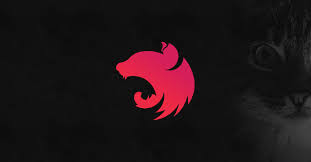

# Learning

<table data-view="cards"><thead><tr><th></th><th></th><th data-hidden></th></tr></thead><tbody><tr><td>

<a href="next.js.md">NextJS &#x26; React</a>
</td><td></td><td></td></tr><tr><td>

<a href="angular/">Angular</a>
</td><td></td><td></td></tr><tr><td></td><td><a href="golang-backend-development/">Golang Backend API Dev</a></td><td></td></tr><tr><td></td><td>

<a href="api-design-and-implementation/">API Design and Implementation</a>
</td><td></td></tr><tr><td></td><td>

<a href="nestjs.md">NestJS</a>
</td><td></td></tr></tbody></table>

#### TODO

* Github CI/CD
* DevOps (i.e. Docker, Kubernetes) concept and implementation

