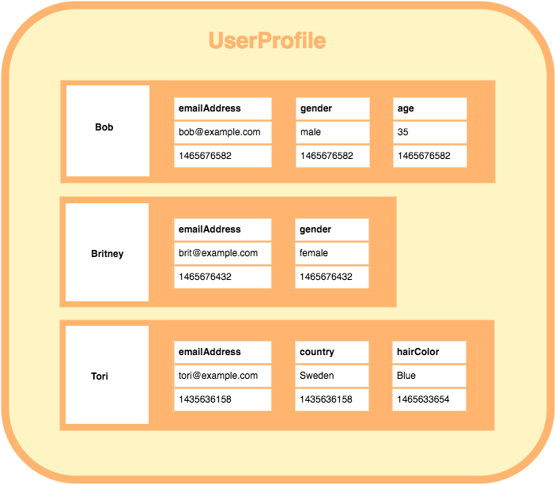

# \[NoSQL] 4 types of NoSQL database schema

### Key-Value (Redis, DynamoDB)

_Each key is associated with a single value._

_Use Case_&#x20;

1. Small data size with flexible data storage.&#x20;
2. Data model is very simple

Downsides 👎&#x20;

1. Data size limitation: Redis store data in-memory; DynamoDB has 400 kb limitation.
2. Not supportive for complex data processing such as grouping

### Document-oriented (MongoDB, CouchDB)

_Each document contains a set of key-value pairs._&#x20;

_Here's the table comparing MongoDB and CouchDB, you can access the article -_ [_MongoDB vs CouchDB_](https://www.mongodb.com/compare/couchdb-vs-mongodb) _to get more detail comparison_

|                | MongoDB                                          | CouchDB                                        |
| -------------- | ------------------------------------------------ | ---------------------------------------------- |
| Data storage   | BSON                                             | JSON                                           |
| Protocols      | binary/custom                                    | HTTP/REST                                      |
| Consistency    | Strong consistency                               | Eventual consistency                           |
| Query Language | MQL                                              | HTTP Rest API                                  |
| Performance    | Replica / Sharding (User can define themselves)  | Replica / Sharding (More limitation)           |
| Indexing       | Easy to set secondary index                      | Requires special “Design Document” definition. |

_Use Case_

1. The data schema is semi-structured

Downsides 👎

1. It's not design for performing complex analytical queries&#x20;
2. When there're mostly read-only use cases, column-family is better

### Column-family (Cassandra, BigTable, Hbase)

_Each keyspace(database) has column-family(table). Each column family has multiple rows(row), each rows contains a row-key and different number of column, in each column contains a column name, value, and timestamp._

____.png>)__

Use case

1. When data between different table has high relationship like a relational database
2. High-traffic read and analytic request because the schema is designed for aggregation queries like COUNT, SUM, etc.

Downsides 👎

1. Too complex for simple application because it doesn't wield its high-performance strength.

### Graph (Neo4j)&#x20;

_Data is represented as nodes and edges._&#x20;

Use case&#x20;

1. If data has complex relationships such as social network, which contains **a set of entities and their relationship**, a graph database provides powerful traversal and querying capabilities.
2. If you need to run **graph algorithms** such as shortest path, centrality or community detection a graph database is the best choice.

\
